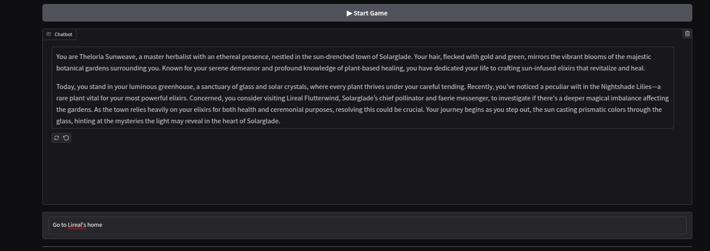
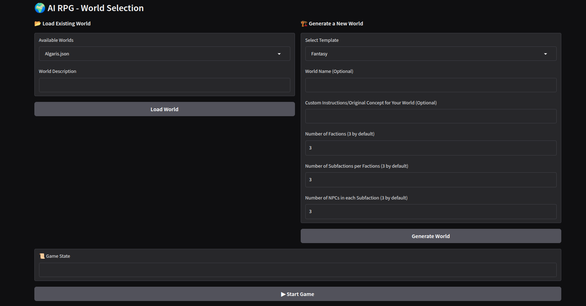

# **🧙 AI RPG Chatbot Game** 🎭🗡️  

An **interactive AI-driven RPG** where you explore, interact, and shape the story through dynamic text-based gameplay.



---

## **🚀 Features**
- 🧠 **AI-Powered Storytelling** – Every action influences the world.
- 🌍 **Fully Customizable Worlds** – Generate or load worlds dynamically.
- 🎮 **Intuitive Web Interface** – Built with **Gradio** for easy access.
- 📜 **Persistent Game State** – Saves your world and progress in JSON files.
- 🛑 **Content Moderation** – Filters inappropriate content for safe play.

---

## **🛠️ Installation & Setup**

### **1️⃣ Clone the Repository**
```sh
git clone https://github.com/your-repo/GameChatBot.git
cd GameChatBot
```

### 2️⃣ Set Up a Virtual Environment
```sh
python3 -m venv venv
source venv/bin/activate  # Linux/Mac
venv\Scripts\activate     # Windows
```

### 3️⃣ Install Dependencies
```sh
pip install -r requirements.txt
```

### 4️⃣ Set Up API Keys
Create a .env file in the project root and add:
```sh
OPENAI_API_KEY=your_openai_api_key
```
Or modify config.py to directly include your OpenAI API key.

---

## 🎮 How to Run the Game
Simply execute:
```sh
python3 main.py
```
    - The script will start a Gradio web interface.
    - Look for the terminal output:
```sh
* Running on local URL:  http://127.0.0.1:7860
* Running on public URL: https://xxxxx.gradio.live
```
    - Click the URL to open the game in your browser.
    - Select a world, start the game, and enjoy the AI-powered RPG experience!

---

## 🌍 Creating or Loading a World



### 1️⃣ Load an Existing World
    - Worlds are stored in shared_data/
    - Use the dropdown menu in the UI to select a saved world.

### 2️⃣ Generate a New World
    - Select Fantasy, Sci-Fi, or Cyberpunk from the world creation panel.
    - Customize the world’s factions, subfactions, and NPCs.
    - Click Generate World and start playing!

---

## 🛑 Moderation & Safety

The moderation_safety.py script ensures user messages comply with community guidelines by filtering inappropriate content.

---

## 📜 License

This project is open-source under the MIT License.

Enjoy your AI RPG adventure! 🎭⚔️🚀